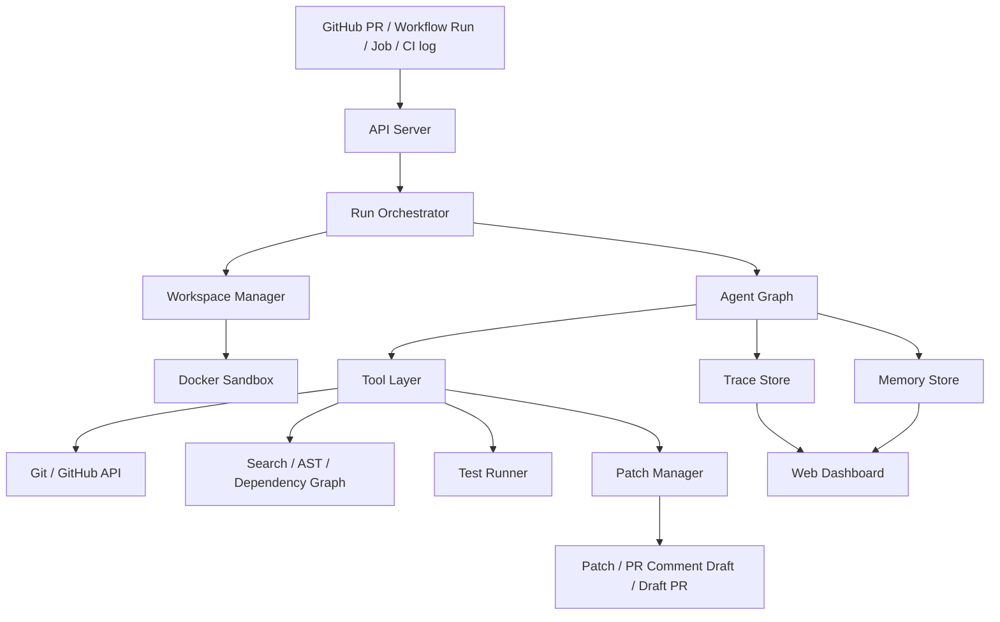
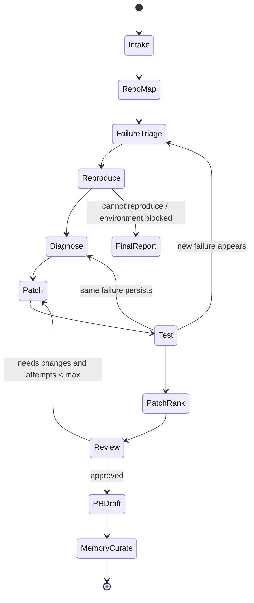

# 基于多 Agent 的 CI 失败诊断与自动修复系统规划

## 1. 项目定位

项目暂定名：`CIFix Agent`。

这是一个面向 GitHub / GitLab 仓库的多 Agent 软件维护系统。第一版以真实 GitHub 项目为主，核心目标不是“自动部署并维护整个项目”，而是聚焦一个更窄、更可完成、更适合简历展示的场景：

> 当一个 GitHub Pull Request、workflow run、job 或 commit 触发 CI 失败时，系统自动读取失败日志、理解仓库结构、复现失败、定位原因、生成最小修复 patch、运行验证测试，并输出 PR 级别的修复建议和风险报告。

更准确的卖点不是“我用了多 Agent”，而是：

> 系统把每次 CI 失败抽象成 `Failure Fingerprint`，用 BM25 + 向量检索的 Hybrid Repair RAG 召回历史修复证据，把验证通过的修复沉淀成 `Verified Repair Memory`，再通过 `Patch Tournament` 自动比较多个候选修复，选择证据最充分、改动最小、风险最低的方案。

它对标的不是“聊天式多 Agent demo”，而是一个真实工程工作流：

```text
CI failure / issue / PR
  -> failure triage
  -> failure fingerprint
  -> repo understanding
  -> repair memory retrieval
  -> local reproduction
  -> root-cause diagnosis
  -> multiple patch candidates
  -> test verification
  -> patch ranking
  -> code review
  -> PR comment / patch report
```

## 1.1 术语表

这些词第一次看会有点工程黑话，先用人话解释：

| 术语 | 英文全称 / 常见含义 | 人话解释 |
|---|---|---|
| CI | Continuous Integration | 自动检查代码有没有问题的流水线。每次提交代码后，平台自动跑测试、类型检查、lint、构建等。 |
| CI 失败 / CI 红灯 | CI failed | 自动检查没通过。例如测试挂了、类型报错、构建失败。 |
| GitHub / GitLab 仓库 / repo | repository | 一个项目的代码仓库。 |
| Issue | issue | GitHub / GitLab 上的问题单，可以是 bug、需求、任务、讨论。 |
| PR | Pull Request | GitHub 里向项目提交代码改动的合并请求。别人会在 PR 里看 diff、评论、跑 CI。 |
| MR | Merge Request | GitLab 里的合并请求，概念上接近 GitHub 的 PR。 |
| commit | commit | 一次代码提交记录。 |
| branch | branch | 分支。开发者通常在新分支上改代码，再通过 PR / MR 合进主分支。 |
| diff | difference | 本次改了哪些代码。 |
| patch | patch | 一组具体代码修改，可以理解为“修复补丁”。 |
| workflow run / job | GitHub Actions 里的流水线运行和任务 | 一个 workflow run 里可能有多个 job，例如 test、lint、build。 |
| pipeline / job | GitLab CI 里的流水线和任务 | GitLab 版本的 CI 流水线概念。第一版优先支持 GitHub workflow/job，后续可适配 GitLab pipeline/job。 |
| log | 日志 | CI 运行过程输出的文字，里面通常有报错原因。 |
| stack trace | 调用栈 | 程序报错时打印的“错误从哪里一路传出来”的路径。 |
| lint | 代码规范检查 | 检查代码格式、潜在坏味道、未使用变量等。 |
| typecheck | 类型检查 | TypeScript 等语言检查类型是否匹配。 |
| flaky test | 不稳定测试 | 有时过、有时不过的测试，不一定是业务代码真的坏了。 |
| RAG | Retrieval-Augmented Generation | 先检索相关资料或历史经验，再让模型基于检索结果推理和生成。 |
| trace | 执行轨迹 | 系统每一步做了什么、调用了什么工具、为什么这么判断的完整记录。 |
| sandbox | 沙箱 | 隔离环境。让 Agent 跑命令和改代码时不影响真实机器。 |
| baseline | 基线 | 用来对比的简单版本。例如单 Agent 版本、无 memory 版本。 |
| eval / benchmark | 评测集 | 一组固定测试案例，用来衡量系统是不是真的有效。 |

## 2. 为什么不做通用自动程序员

已有项目已经覆盖了“通用软件工程 Agent”方向，例如 SWE-agent、OpenHands、aider 等。学生项目如果直接做“输入 issue 自动修任意代码”，很容易变成换皮项目，而且范围太大，完成度很难打磨。

本项目选择更垂直的 CI 失败诊断，有三个原因：

1. **验证标准明确**：CI 是否恢复通过、目标测试是否通过、patch 是否足够小。
2. **工程链路完整**：仍然包含工具调用、代码理解、沙箱执行、状态编排、记忆、人工审批和可观测性。
3. **简历可信度更高**：可以用自建 case set 给出成功率、平均修复轮数、耗时、token 成本等指标。

## 2.1 同类项目与差异定位

这个方向已经有强同类，不能包装成“没人做过的自动程序员”：

| 同类项目 | 已覆盖能力 | 本项目不与它正面硬刚的原因 |
|---|---|---|
| SWE-agent | 接收 GitHub issue，在真实仓库中尝试自动修复 | 它是通用 issue 修复 agent，本项目聚焦 CI 失败、repair memory 和 patch ranking |
| OpenHands | 通用软件开发 agent 平台，可执行真实工程任务 | 它更像通用 agent runtime / cloud coding 平台，本项目更像 CI maintenance workflow |
| GitHub Copilot coding agent | 可从 GitHub issue / GitHub UI 启动，修改分支并创建 PR | 它是平台级 coding agent，本项目重点展示可学习、可评测、可回放的 CI 自愈闭环 |
| Sweep | 面向 GitHub/IDE 的 AI coding assistant / agent | 它偏代码生成和开发助手，本项目偏失败诊断、验证排序和维护知识沉淀 |

本项目的差异定位：

1. **CI failure vertical**
   - 不做“修所有 issue”。
   - 只做 GitHub Actions 失败场景：日志解析、失败分类、复现、修复、验证、PR 评论草稿。

2. **Failure Fingerprint**
   - 把 job logs、错误码、失败文件、变更文件、测试命令和运行环境结构化，作为可检索对象。
   - 目标不是让 LLM 直接读一大段日志，而是先把失败压缩成工程特征。

3. **Hybrid Repair RAG**
   - 记忆不是聊天记录，而是验证过的修复策略、失败 fingerprint、patch summary 和验证命令。
   - 检索不是手写 if/else，而是 BM25 关键词召回 + 向量相似度召回 + hybrid rerank。
   - 每条 memory 都有适用条件、验证命令、成功/失败次数、置信度和检索证据。

4. **Patch Tournament**
   - 不只生成一个 patch，而是生成多个候选 patch。
   - 通过测试结果、diff 大小、风险分、Hybrid RAG 命中证据排序。

5. **Benchmark-first**
   - 项目必须自带 eval cases 和 baseline。
   - 用 single-agent、no-memory、no-tournament 做对比，证明设计确实有增益。

面试时不要说：

> 我做了一个类似 Copilot / SWE-agent 的自动程序员。

应该说：

> 通用 coding agent 已经很多，我选择了 CI 失败维护这个更窄但高频的工程场景，重点做 failure fingerprint、Hybrid Repair RAG、patch tournament 和可回放评测。我的目标不是替代 Copilot，而是做一个让 coding agent 在 CI 红灯场景里更可控、可学习、可评测的 workflow layer。

## 3. 非目标

本项目的非目标不是“少做能力”，而是明确边界，避免变成通用版 Codex / Claude Code。

### 3.1 长期非目标

- 不自动部署生产环境。
- 不自动 merge PR / MR。
- 不做完全开放的 shell 执行器。
- 不把多个 Agent 做成“角色扮演聊天室”。
- 不把 memory 做成无限制的聊天记录堆叠。
- 不追求修复所有 GitHub / GitLab issue 或所有软件缺陷。
- 不承诺完全无人值守地修改真实项目代码。

### 3.2 MVP 暂不覆盖

- 不支持任意语言和任意构建系统，第一版优先支持 TypeScript / Node 项目。
- 不做复杂线上事故定位，第一版只处理 CI 日志和本地可复现失败。
- 不做大规模重构类修复，只做小范围、可验证的维护 patch。
- 不自动学习未经验证的经验，只有测试通过或人工确认后的结果才能进入 repair playbook。
- 不默认创建正式 PR / MR，第一版优先输出 patch、验证结果、风险报告和 PR comment 草稿。

系统最多做到：读取真实 GitHub 项目失败上下文、生成候选 patch、跑验证、排序推荐、创建 PR comment 草稿或可选 draft PR；危险操作必须人工确认。

## 4. 目标用户与使用场景

### 4.1 目标用户

- 维护中小型开源项目的开发者。
- 需要快速处理 CI 红灯的团队。
- 想要在代码库内沉淀故障模式和修复经验的工程团队。
- AI Infra / DevTools 团队，用来评估 coding agent 是否能进入真实研发流程。

### 4.2 典型场景

1. **GitHub PR 测试失败**
   - 输入 GitHub PR URL。
   - 系统拉取 PR diff、相关 workflow run、failed jobs 和 job logs。
   - 定位失败测试、相关代码和最近改动。
   - 生成修复 patch 并验证。

2. **依赖升级导致 CI 挂掉**
   - 输入依赖升级 PR。
   - 系统判断是 API breaking change、lockfile 问题、环境问题还是测试断言过期。
   - 生成兼容性修复方案。

3. **lint/typecheck 失败**
   - 系统读取 lint/typecheck 输出。
   - 生成最小改动 patch。
   - 跑 targeted command 验证。

4. **flaky test 识别**
   - 同一测试多次运行结果不稳定。
   - 系统标记为疑似 flaky，输出证据而不是盲目改业务代码。

### 4.2.1 开源项目测试策略

第一版可以接入别人 GitHub 上的开源项目做真实测试，但必须采用“只读上游 + 本地验证 + 可选 fork”的策略。

推荐测试路径：

1. 选择一个公开 GitHub 项目，优先选择 TypeScript / Node / React 项目。
2. 找到一个失败的 PR、失败的 workflow run，或在自己的 fork 中创建一个会失败的 PR。
3. 系统读取上游公开 PR diff、workflow run、failed job logs。
4. 系统 clone 代码到本地 sandbox，在本地应用候选 patch 并跑测试。
5. 输出 patch、诊断报告和 PR comment 草稿。
6. 默认不向上游项目写评论、不创建 PR、不打扰维护者。

更稳的展示方式：

- fork 一个真实开源项目到自己的 GitHub 账号。
- 在 fork 中创建几个故意失败的 PR。
- 用这些 PR 作为稳定 demo 和 eval case。
- 需要时再拿真实上游失败 PR 做只读分析，证明系统能读真实世界输入。

这样既能展示“接入真实开源项目”，又能避免依赖公司项目、污染上游项目或触碰权限边界。

## 4.3 落地价值

这个项目的落地价值不是“替代程序员写代码”，而是降低团队处理 CI 红灯的时间成本，并把一次次临时排障沉淀成可复用知识。

真实团队里的 CI 失败通常有几个痛点：

- 开发者需要在大量日志里找真正的失败点。
- 新人不熟悉仓库，不知道该跑哪个测试命令。
- 很多失败是重复模式，但团队没有结构化沉淀。
- 通用 coding agent 可以修一次，但很难告诉团队“这类问题以后怎么更快处理”。
- 公司不敢让 Agent 无约束地跑 shell、改代码、开 PR。

本项目解决的是这些工程化问题：

- **减少排障时间**：自动解析 CI log，生成 failure fingerprint 和候选根因。
- **降低上下文成本**：Repo Memory 记录测试命令、模块结构、历史 flaky test。
- **沉淀团队经验**：Verified Repair Playbook 记录经过验证的修复策略和成功率。
- **控制执行风险**：Docker sandbox、命令 allowlist、超时、最大改动文件数、人工审批。
- **支持管理决策**：通过 benchmark dashboard 量化成功率、成本、耗时和失败类型分布。

可以把它定位成：

> 面向 CI 失败场景的 Agent 工作流平台，而不是又一个通用聊天式 coding agent。

## 4.4 非玩具完成度标准

为了能放进硕士求职简历，最终版本至少要达到以下标准：

| 维度 | 玩具 demo | 简历级项目标准 |
|---|---|---|
| 输入 | 只粘贴一段错误文本 | 第一版支持真实 GitHub PR / workflow run / job URL，同时支持本地 fixture 和 CI log 文件 |
| 输出 | 一段自然语言建议 | 结构化诊断报告、候选 patch、测试结果、风险报告、PR comment 草稿 |
| 执行 | 模型直接回答 | 在 sandbox 中真实应用 patch 并运行测试命令 |
| 记忆 | 保存聊天记录 | 只保存验证过的 repair playbook、repo memory 和 failure fingerprint |
| 多 Agent | 多角色对话 | 通过状态图隔离诊断、修复、测试、审查、记忆写入权限 |
| 评测 | 展示一个成功样例 | 至少 20 个 case，包含 single-agent / no-memory / no-tournament baseline |
| 可观测性 | 看不到过程 | 每次 run 有 trace、tool call、memory hit、patch ranking 记录 |
| 安全性 | 任意命令执行 | Docker sandbox、allowlist、timeout、人工确认 |
| 产品形态 | 命令行脚本 | CLI + Web Dashboard，能看 run 列表、详情、diff、eval 指标 |

如果最终只能跑 1-2 个手写样例，就不应该作为主项目写进简历。合格版本应该能回答：

- 它在多少个 case 上评测过？
- 成功率是多少？
- memory 是否真的带来提升？
- patch tournament 是否比单 patch 更稳？
- 为什么某次失败没有修成功？
- 它做了哪些安全限制？

## 5. 核心功能清单

### 5.0 初版产品形态

初版不是后台常驻服务，而是一个可以手动触发的 GitHub Actions 修复工作台，包含三个入口。第一版必须能对接真实 GitHub 项目；本地 fixture 只用于离线调试和 eval。

#### 1. CLI 入口

用于真实 GitHub 项目、本地开发、eval 和面试演示。

```bash
cifix run \
  --repo owner/repo \
  --pr 123 \
  --token-env GITHUB_TOKEN
```

也支持更精确的 workflow run / job 输入：

```bash
cifix run \
  --repo owner/repo \
  --run-id 456789 \
  --job 987654 \
  --token-env GITHUB_TOKEN
```

输出：

```text
run_id: run_20260615_001
status: success
recommended_patch: artifacts/run_20260615_001/patch.diff
report: artifacts/run_20260615_001/report.md
trace: artifacts/run_20260615_001/trace.json
pr_comment_draft: artifacts/run_20260615_001/pr-comment.md
```

#### 2. Web Dashboard 入口

用于产品化展示。

输入表单：

- GitHub repo，例如 `owner/repo`。
- PR number、workflow run id 或 job id。
- GitHub access token，公开仓库可选，私有仓库必需。
- 可选 failing command。
- 可选 CI log 文件或粘贴日志，用于 API 不可达时兜底。
- 可选 base/head commit。

输出页面：

- failure fingerprint。
- evidence board。
- repair playbook 命中。
- patch tournament 对比。
- test verification。
- risk report。
- PR comment draft。
- full trace。

#### 3. Eval Runner 入口

用于证明项目不是 demo。

```bash
cifix eval --cases ./eval-cases/typescript-node --baseline all
```

输出：

- 总成功率。
- 按失败类型拆分的成功率。
- single-agent / no-memory / no-tournament baseline 对比。
- 平均耗时、成本、patch 轮数。
- 失败案例分析。

### 5.0.1 真实 GitHub MVP 输入输出契约

第一版必须支持真实 GitHub 项目，但采用“只读拉取 + 本地修复 + 草稿输出”的安全模式。

#### 必需输入

三种输入至少支持一种，推荐三种都支持：

1. PR URL：

```text
https://github.com/owner/repo/pull/123
```

2. Workflow run URL：

```text
https://github.com/owner/repo/actions/runs/456789
```

3. Job URL：

```text
https://github.com/owner/repo/actions/runs/456789/job/987654
```

附加输入：

- `GITHUB_TOKEN`：第一版建议使用最小读权限 token。
  - 公开仓库：可先无 token 读取公开 PR 和 Actions 信息，但会受 API rate limit 限制。
  - 公开开源项目测试：建议使用只读 token 提高稳定性，只做本地验证，不默认写回上游。
  - 私有仓库：需要仓库 contents read、actions read、pull requests read 权限。
  - 写 PR 评论：需要 issues / pull requests 写权限，并且必须显式开启写回。
  - 推送修复分支：需要 contents write 权限，并且第一版只建议对自己的 fork 开启。
- 可选 `failingCommand`：如果系统不能从 CI 日志中推断复现命令，允许用户手动指定。
- 可选 `baseRef/headRef`：当 PR 信息不可用时手动指定。

#### 系统自动读取

- owner / repo。
- PR metadata 和 diff。
- PR head branch / base branch。
- workflow run 状态。
- failed jobs。
- failed job logs。
- commit SHA。
- 仓库代码。

#### 系统本地执行

- clone 仓库到隔离 workspace。
- checkout PR head commit。
- 根据日志和 repo map 推断 install/test 命令。
- 生成 Failure Fingerprint。
- 用结构化匹配 + 轻量 RAG 检索 Verified Repair Playbook。
- 在 sandbox 内执行复现命令。
- 生成 2-3 个候选 patch。
- 对候选 patch 分别执行 targeted verification。
- 排序推荐一个 patch。

#### 明确输出

```text
artifacts/<run_id>/
  report.md              # 诊断报告
  patch.diff             # 推荐修复 patch
  patch-candidates/      # 所有候选 patch
  trace.json             # Agent 和工具调用轨迹
  failure-fingerprint.json
  repair-playbook-hits.json
  verification.json      # 测试命令和结果
  risk-report.md
  pr-comment.md          # 可复制到 GitHub PR 的评论草稿
```

第一版默认不写回 GitHub。只有用户显式开启 `--write-comment` 或 `--create-draft-pr`，并提供相应权限 token，系统才允许写操作。

### 5.0.2 权限模式

系统只设计两种权限模式，避免权限模型过度复杂。

#### 1. Readonly Mode

适用对象：

- 别人的公开开源仓库。
- 没有写权限的组织仓库。
- 只想做诊断和本地验证的场景。

允许操作：

- 读取公开代码、PR、workflow run、failed job logs。
- clone 到本地 sandbox。
- 在本地 sandbox 里应用候选 patch。
- 本地运行测试验证。
- 输出 `patch.diff`、诊断报告、风险报告、PR comment 草稿。

禁止操作：

- push 分支。
- 写 PR 评论。
- 创建 PR。
- merge PR。
- 修改远端仓库任何内容。

#### 2. Writable Mode

适用对象：

- 自己的 GitHub 仓库。
- 自己 fork 的开源仓库。
- 明确拥有写权限的组织仓库。

允许操作：

- Readonly Mode 的全部能力。
- 在人工确认后 push 修复分支。
- 在人工确认后写 PR 评论。
- 在人工确认后创建 draft PR。

禁止操作：

- 默认不写回远端。
- 不自动 merge。
- 不直接修改 protected branch。
- 不绕过人工确认执行高风险操作。

一句话边界：

```text
Readonly Mode:
  remote repo is read-only
  local sandbox can change
  output patch/report only

Writable Mode:
  remote repo is writable
  local sandbox can change
  can push branch / comment / create draft PR after confirmation
  never auto-merge
```

### 5.1 MVP 功能

- GitHub 项目 / PR / workflow run / job / CI log 导入。
- 仓库克隆与隔离 workspace 创建。
- CI 失败日志解析。
- 仓库结构扫描：语言、包管理器、测试框架、关键配置文件。
- 失败类型分类：
  - test assertion failure
  - typecheck failure
  - lint failure
  - dependency / lockfile failure
  - environment setup failure
  - flaky test suspected
- 目标文件定位：
  - 通过 stack trace。
  - 通过最近 diff。
  - 通过 symbol / keyword 搜索。
  - 通过测试文件与源文件映射。
- 复现命令生成与执行。
- Failure Fingerprint 生成：把失败日志、错误码、失败文件、变更文件、测试命令、环境信息结构化。
- 轻量 RAG：用结构化字段匹配 + 简单向量检索召回 repair playbook。
- Verified Repair Playbook 检索：根据 fingerprint 召回历史验证过的修复经验，并在 trace 中展示命中依据。
- patch 生成。
- Patch Tournament：生成多个候选 patch，并根据测试结果、改动范围、风险和历史 playbook 匹配度排序。
- targeted test 验证。
- patch review 与风险报告。
- trace 页面：展示每一步 Agent 决策、工具调用、耗时、输入输出摘要。
- eval 页面：展示自建 case set 的成功率和失败原因。

### 5.1.1 MVP 三大创新点验收标准

第一版必须同时满足三个创新点的最小闭环，不能只做其中一个。

#### 1. Failure Fingerprint 必须完整做

从真实 GitHub Actions job logs 中生成结构化 fingerprint。

最低字段：

```json
{
  "platform": "github",
  "project": "group/service",
  "mr": 123,
  "runId": 456789,
  "job": 987654,
  "failureType": "typecheck_error",
  "errorCode": "TS2322",
  "failedFiles": ["src/api/user.ts"],
  "changedFiles": ["src/api/user.ts", "src/types/user.ts"],
  "command": "pnpm typecheck",
  "normalizedSignature": "typescript:typecheck:TS2322:api"
}
```

验收：

- 每个 run 都产出 `failure-fingerprint.json`。
- Run Detail 页面能展示 fingerprint。
- fingerprint 至少参与 repair playbook 检索和 patch ranking。

#### 2. Hybrid Repair RAG：BM25 + 向量检索

第一版不需要大规模经验库，但必须有真正的混合检索链路：BM25 负责错误码、文件名、测试名等精确匹配；向量检索负责相似失败模式召回；hybrid rerank 将 BM25、vector cosine 和 confidence 融合排序。

最低字段：

```json
{
  "failureSignature": "typescript:typecheck:TS2322:api",
  "strategy": "优先检查 API adapter 输出字段与 shared type 是否一致。",
  "patchSummary": {"changedFiles": ["src/api/user.ts"], "riskTags": ["source-change"]},
  "verificationCommands": ["pnpm typecheck"],
  "successCount": 2,
  "failureCount": 1,
  "confidence": 0.67
}
```

检索方式：

- 将静态 playbook 和 verified repair memory 写入 SQLite BM25/payload index，并将向量写入 ChromaDB vector database。
- 查询文本由 `Failure Fingerprint + CI log preview + reproduction stdout/stderr` 组成。
- BM25 对 `errorCode`、`normalizedSignature`、failed files、strategy 等字段排分。
- 向量检索使用 ChromaDB 存储 embedding，默认可使用 DashScope/Qwen `text-embedding-v4` 或 Zhipu `embedding-3`，无密钥环境下保留 hashing vector fallback。
- Hybrid rerank 融合 `BM25 score`、`vector score` 和历史置信度。

验收：

- 至少预置 5-10 条 repair playbook。
- 每次 run 输出 `repair-playbook-hits.json`。
- trace 中展示命中的 memory、`bm25Score`、`vectorScore`、`hybridScore`、matched terms、vector backend、vector DB path 和 index path。
- Diagnosis / Patch 至少能读取 top 3 RAG hit 作为上下文。
- 修复成功后写入 verified repair memory，并在下一次 run 中进入 RAG index。

#### 3. Patch Tournament 必须做最小闭环

第一版不能只生成一个 patch，至少要比较两个候选修复。

最低流程：

```text
Patch A：根据 top hypothesis 修改业务代码
Patch B：根据 alternative hypothesis 修改测试/类型/adapter

对每个 patch：
  1. apply patch
  2. run targeted verification
  3. collect diff size / changed files / test result / risk score
  4. revert patch

最后：
  rank candidates
  select recommended patch
  output ranking rationale
```

验收：

- 每个成功 run 至少生成 2 个候选 patch。
- 每个候选 patch 有独立验证结果。
- 最终输出 `patch-candidates/` 和推荐 `patch.diff`。
- Run Detail 页面能展示候选 patch 对比和排序原因。
- eval 指标里统计 `patch_tournament_win_rate`。

### 5.2 第二阶段功能

- GitHub 写回：在人工确认后把 PR comment 写回 GitHub。
- GitHub webhook 自动触发：监听 pull_request / workflow_run 事件，自动创建 run。
- 可选创建 draft PR 或推送修复分支，必须人工确认。
- 多语言支持优先级：
  1. TypeScript / JavaScript
  2. Python
  3. Go 或 Java
- 受影响测试选择：根据 diff、依赖图、失败栈选择最小测试集合。
- memory 命中解释：告诉用户这次使用了哪些历史经验。
- patch 回滚和多轮修复。
- repair playbook 自动沉淀增强：成功修复后生成可复用修复策略，失败案例生成 negative lesson。

### 5.3 第三阶段功能

- 仓库级长期画像：模块地图、常用测试命令、历史 flaky test、常见失败模式。
- 自动生成 regression test。
- 对多个修复候选 patch 做 ranking。
- failure fingerprint 聚类：把一批相似 CI 失败聚到同一类，帮助团队发现高频维护问题。
- 成本控制：模型选择、上下文压缩、缓存、工具结果摘要。
- 团队偏好：commit message 风格、PR 模板、禁止改动目录、测试门禁。

## 6. 系统架构



建议实现方式：

- 后端：FastAPI 或 Hono。
- Agent 编排：LangGraph 或 OpenAI Agents SDK。
- 执行环境：Docker sandbox。
- 数据库：PostgreSQL，MVP 可先 SQLite。
- 向量检索：pgvector、Qdrant 或 Chroma，MVP 可先用 sqlite-vec / Chroma。
- 前端：React + Vite，做任务列表、trace、patch diff、eval dashboard。

## 7. 多 Agent 设计

本项目的多 Agent 不采用自由聊天模式，而采用“状态图 + 专家节点”的方式。每个 Agent 只负责一个窄职责，读写共享状态，并通过 orchestrator 控制流程。

### 7.1 共享状态

每个 run 维护一份结构化状态：

```ts
type RunState = {
  runId: string;
  repo: {
    url: string;
    branch: string;
    baseSha?: string;
    headSha?: string;
    languages: string[];
    packageManagers: string[];
    testCommands: string[];
  };
  ci: {
    provider: "github_actions" | "manual_log";
    rawLogRef: string;
    failedJobs: FailedJob[];
    failureSummary?: string;
  };
  evidence: EvidenceItem[];
  hypotheses: Hypothesis[];
  patchAttempts: PatchAttempt[];
  verification: VerificationResult[];
  riskReport?: RiskReport;
  memoryHits: MemoryHit[];
  nextAction: AgentAction;
};
```

### 7.2 Agent 角色

#### 1. Intake Agent

职责：

- 解析用户输入的 repo、PR、workflow run、job、commit、CI log。
- 判断任务是否适合自动处理。
- 生成初始任务范围。

输出：

- repo metadata
- CI provider
- run scope
- safety flags

#### 2. Repo Mapper Agent

职责：

- 识别项目语言、包管理器、测试框架。
- 建立文件树摘要。
- 找到 package scripts、CI 配置、测试目录、源码目录。

工具：

- `list_files`
- `read_file`
- `ripgrep`
- `parse_package_json`
- `parse_pyproject`
- `parse_github_actions_workflow`

输出：

- repo map
- probable test commands
- module ownership hints

#### 3. Failure Triage Agent

职责：

- 解析 CI 日志。
- 抽取失败测试、错误栈、退出码、相关文件路径。
- 对失败类型分类。
- 生成 Failure Fingerprint，用于后续检索历史修复经验和聚类统计。

输出：

- failure taxonomy
- failure fingerprint
- failed symbols
- candidate files
- confidence score

#### 4. Reproducer Agent

职责：

- 在 sandbox 内复现失败。
- 生成 targeted command。
- 判断失败是否稳定。

工具：

- `run_command`
- `read_command_output`
- `retry_command`

输出：

- reproduction result
- stable / flaky 判断
- 最小复现命令

#### 5. Diagnosis Agent

职责：

- 基于日志、diff、代码上下文、历史 memory 生成 root cause 假设。
- 为每个假设绑定证据。
- 选择最可能的修复方向。
- 根据 Failure Fingerprint 召回 Verified Repair Playbook，判断历史策略是否适用。

输出：

- ranked hypotheses
- evidence links
- matched repair playbooks
- fix strategy

#### 6. Patch Agent

职责：

- 生成多个候选 patch，而不是只给一个答案。
- 避免大范围重构。
- 记录每次 patch attempt 的意图。
- 为每个候选 patch 标记它对应的 hypothesis 和 repair playbook。

工具：

- `read_file`
- `apply_patch`
- `git_diff`
- `revert_patch`

输出：

- candidate patch diff
- changed files
- patch rationale

#### 6.5 Patch Ranker Agent

职责：

- 对多个候选 patch 做排序。
- 比较测试结果、改动范围、风险分、历史 playbook 匹配度。
- 选择推荐 patch，或要求 Patch Agent 重新生成。

输出：

- ranked patch candidates
- selected patch
- ranking rationale

#### 7. Test Agent

职责：

- 跑 targeted test。
- 必要时跑 broader test。
- 比较 patch 前后结果。

输出：

- pass / fail
- failing command
- regression risk

#### 8. Review Agent

职责：

- 像代码审查一样检查 patch。
- 检查是否过拟合测试、是否引入兼容性风险、是否修改无关文件。
- 决定是否回到 Patch Agent。

输出：

- review findings
- approve / request changes
- risk score

#### 9. PR Writer Agent

职责：

- 生成 PR comment、修复摘要和 test plan。
- 可选生成 draft PR title、description。
- 总结用户需要人工确认的点。

输出：

- PR comment draft
- optional draft PR metadata
- final report

#### 10. Memory Curator Agent

职责：

- 在任务结束后提炼可复用经验。
- 只把经过验证的事实写入长期记忆。
- 更新仓库画像、失败模式、测试命令、flaky test 记录。

输出：

- created / updated memories
- memory invalidation suggestions

## 8. 编排方式

### 8.1 主流程



### 8.2 循环控制

为避免 Agent 无限制自我循环：

- 每个 run 最多 3 次 patch attempt。
- 每轮最多生成 3 个候选 patch。
- 每次 patch 最多修改 5 个文件，超过需要人工确认。
- `run_command` 默认超时，例如 120 秒。
- shell 命令使用 allowlist。
- 如果连续两次测试失败原因相同，必须回到 Diagnosis Agent 重新建模。
- 如果失败类型变了，需要重新 triage。

### 8.3 Supervisor 策略

Supervisor 不直接写代码，只做三件事：

1. 根据当前状态选择下一个 Agent。
2. 检查是否满足停止条件。
3. 维护 structured trace。

Supervisor 的输出必须是结构化 JSON，例如：

```json
{
  "nextAgent": "patch",
  "reason": "The failure is reproduced and top hypothesis has enough evidence.",
  "stop": false,
  "requiredInputs": ["candidateFiles", "topHypothesis", "reproductionCommand"]
}
```

这样可以避免多 Agent 系统退化成“大家轮流说话”。

## 9. 记忆设计

记忆是这个项目的关键创新点之一，但不能简单保存所有聊天记录。建议分成四层。

### 9.1 Run Memory：单次任务短期记忆

范围：一个 run 内有效。

内容：

- 读过哪些文件。
- 跑过哪些命令。
- 每个命令的结果摘要。
- 当前 hypothesis。
- patch attempt 历史。
- review findings。

存储：

- `run_state`
- `agent_steps`
- `tool_calls`
- `artifacts`

作用：

- 支持多 Agent 共享上下文。
- 支持失败后回放。
- 支持 trace UI。

### 9.2 Repo Memory：仓库级长期记忆

范围：同一个 repo 跨 run 有效。

内容：

- 项目安装命令。
- 常用测试命令。
- 测试框架和目录结构。
- 模块地图。
- known flaky tests。
- 历史 CI 失败类型。
- 不能修改的目录或文件。

写入规则：

- 只由 Memory Curator 在 run 结束后写。
- 只写经过验证的事实。
- 每条 memory 绑定 repo、branch、commit range、来源 run。
- 如果 repo 结构变化，需要降低 memory 权重或标记 stale。

示例：

```json
{
  "scope": "repo",
  "repoUrl": "github.com/example/api",
  "kind": "test_command",
  "content": "For backend unit tests, use `pnpm --filter api test -- --runInBand`.",
  "evidence": ["run_123", "tool_call_456"],
  "confidence": 0.92,
  "validFromSha": "abc123",
  "lastVerifiedAt": "2026-06-15T10:00:00Z"
}
```

### 9.3 Episodic Memory：故障模式记忆

范围：跨 repo 可复用。

内容：

- 依赖升级后类型错误的常见处理方式。
- React 测试快照失败的判断流程。
- Python import path 错误的排查顺序。
- Node lockfile mismatch 的修复策略。

写入规则：

- 成功修复后提炼。
- 失败案例也可以写，但必须标记为 negative lesson。
- 不能写入具体 secret、token、私有业务代码。

作用：

- 帮 Diagnosis Agent 更快形成候选假设。
- 帮 Reproducer Agent 选择更合理的命令。

### 9.4 User / Team Preference Memory：用户偏好记忆

范围：用户或团队级别。

内容：

- PR description / comment 模板。
- commit message 风格。
- 默认禁止修改的目录。
- 是否允许自动创建 draft PR。
- 最高可接受成本。

作用：

- 让系统更像真实内部工具。
- 体现产品化能力。

## 10. Memory 检索与注入策略

每个 Agent 不应该拿到全部 memory，而是按职责检索。

| Agent | 可检索 memory | 用途 |
|---|---|---|
| Repo Mapper | Repo Memory | 快速识别项目结构和命令 |
| Failure Triage | Repo Memory, Episodic Memory | 分类失败类型 |
| Reproducer | Repo Memory | 选择复现命令 |
| Diagnosis | Repo Memory, Episodic Memory | 生成 root cause 假设 |
| Patch | Repo Memory, User Preference | 控制改动范围和风格 |
| Review | User Preference, Repo Memory | 检查风险和规范 |
| PR Writer | User Preference | 生成符合团队习惯的说明 |

检索策略：

1. 先用 metadata filter 缩小范围，例如 repo、language、failure type。
2. 再做 semantic search。
3. 最终只注入 top 3-5 条。
4. 注入内容必须包含 confidence 和 last verified time。
5. Agent 如果使用了 memory，最终 trace 里要展示 memory hit。

## 11. 工具系统设计

工具层要和 Agent 解耦，所有 Agent 只能通过工具访问外部世界。

### 11.1 Repo 工具

- `clone_repo(url, ref)`
- `checkout_ref(ref)`
- `get_diff(base, head)`
- `list_files(glob?)`
- `read_file(path, range?)`
- `search_text(query, glob?)`
- `search_symbol(symbol)`

### 11.2 CI 工具

- `fetch_github_pull_request(owner, repo, pullNumber)`
- `fetch_github_pr_files(owner, repo, pullNumber)`
- `fetch_github_workflow_run(owner, repo, runId)`
- `list_github_workflow_jobs(owner, repo, runId)`
- `download_github_job_logs(owner, repo, jobId)`
- `parse_ci_log(rawLog)`
- `list_failed_jobs(owner, repo, runId)`

### 11.3 Sandbox 工具

- `run_command(command, timeoutMs)`
- `install_dependencies(strategy)`
- `read_command_output(commandId)`
- `kill_command(commandId)`

安全要求：

- 默认命令 allowlist。
- 禁止读取宿主机敏感路径。
- 禁止网络访问或默认只允许包管理器 registry。
- 每个 run 独立 workspace。
- 命令输出脱敏。

### 11.4 Patch 工具

- `apply_patch(patch)`
- `git_diff()`
- `revert_patch(attemptId)`
- `format_changed_files()`

### 11.5 Memory 工具

- `search_memory(scope, query, filters)`
- `propose_memory(memoryDraft)`
- `write_memory(memoryDraft)`
- `invalidate_memory(memoryId, reason)`

注意：普通 Agent 只能 `search_memory` 或 `propose_memory`，最终写入由 Memory Curator 控制。

## 12. 数据模型草案

```text
runs
  id
  platform
  github_owner
  github_repo
  repo_url
  pull_number
  workflow_run_id
  job_id
  base_sha
  head_sha
  failure_fingerprint_id
  status
  created_at
  completed_at

failure_fingerprints
  id
  run_id
  failure_type
  error_code
  failed_file_patterns
  changed_file_patterns
  command
  environment_json
  normalized_signature
  embedding
  created_at

agent_steps
  id
  run_id
  agent_name
  input_summary
  output_summary
  started_at
  completed_at
  status

tool_calls
  id
  run_id
  step_id
  tool_name
  args_json
  result_summary
  artifact_refs
  duration_ms
  status

artifacts
  id
  run_id
  kind
  path
  content_hash
  metadata_json

patch_attempts
  id
  run_id
  attempt_no
  candidate_no
  hypothesis_id
  repair_playbook_id
  diff
  rationale
  test_result
  risk_score
  ranking_score
  review_status

repair_playbooks
  id
  scope
  repo_url
  failure_signature
  applicability_rules_json
  strategy
  verification_commands_json
  success_count
  failure_count
  confidence
  source_run_ids
  last_verified_at
  created_at
  updated_at

memories
  id
  scope
  repo_url
  kind
  content
  embedding
  confidence
  source_run_id
  valid_from_sha
  valid_until_sha
  last_verified_at
  created_at
  updated_at

eval_cases
  id
  repo_url
  fixture_ref
  failure_type
  setup_command
  failing_command
  expected_success_command
  expected_changed_files
```

## 13. 评测设计

这个项目的说服力来自 eval，而不是 UI 多漂亮。

### 13.1 自建 case set

第一版做 20 个 case：

- 5 个 TypeScript typecheck 失败。
- 5 个 frontend unit test 失败。
- 4 个 lint / format 失败。
- 3 个 dependency / lockfile 失败。
- 3 个 flaky / environment failure。

每个 case 包含：

- 初始 repo fixture。
- 失败命令。
- 失败日志。
- 期望通过命令。
- 可接受改动范围。
- ground truth patch，可选。

### 13.2 指标

- `fix_success_rate`：最终验证命令通过的比例。
- `first_patch_success_rate`：第一次 patch 就通过的比例。
- `avg_patch_attempts`：平均 patch 轮数。
- `avg_runtime_seconds`：平均耗时。
- `avg_cost_usd`：平均模型成本。
- `unrelated_change_rate`：是否修改无关文件。
- `memory_hit_rate`：长期记忆被有效使用的比例。
- `playbook_reuse_rate`：本次修复是否复用了历史 verified repair playbook。
- `patch_tournament_win_rate`：被排序器选中的 patch 最终通过验证的比例。
- `fingerprint_cluster_precision`：相似 fingerprint 是否真的对应同类失败。
- `human_intervention_rate`：需要人工介入的比例。

### 13.3 Baseline

至少做两个 baseline：

1. **Single Agent baseline**
   - 一个 Agent 拿所有工具直接修。

2. **No Memory baseline**
   - 多 Agent 编排保留，但关闭长期 memory。

最终报告可以展示：

- 多 Agent 相比单 Agent 是否更稳定。
- Repo Memory 是否减少复现时间。
- Episodic Memory 是否提高诊断准确率。

## 14. 创新点

### 14.1 Failure Fingerprint：把 CI 失败变成可检索对象

系统不只是把 CI 日志塞给模型，而是先把失败标准化成结构化指纹。

示例：

```json
{
  "failureType": "typecheck_error",
  "errorCode": "TS2322",
  "failedFilePatterns": ["src/api/**/*.ts"],
  "changedFilePatterns": ["src/api/**", "src/types/**"],
  "command": "pnpm typecheck",
  "environment": {
    "node": "20",
    "packageManager": "pnpm"
  },
  "normalizedSignature": "typecheck:TS2322:api_adapter:shared_types"
}
```

价值：

- 同类失败可以聚类。
- 可以召回历史修复经验。
- 可以统计团队最常见的维护问题。
- 可以让模型少依赖长日志，多依赖结构化证据。

### 14.2 Hybrid Repair RAG：只沉淀验证过的修复经验

普通 RAG 往往检索“相关文本”，但本项目要沉淀的是“经过测试验证的修复策略”。因此 RAG 文档来自两类来源：

- 静态 repair playbook：人工总结的通用修复经验。
- verified repair memory：系统实际应用 patch 且测试通过后写入的历史修复。

示例：

```json
{
  "failureSignature": "typecheck:TS2322:api_adapter:shared_types",
  "applicabilityRules": [
    "changed_files contains src/api/**",
    "changed_files contains src/types/**",
    "error_code is TS2322"
  ],
  "strategy": "优先检查 API adapter 输出字段是否与 shared type/schema 一致。",
  "verificationCommands": [
    "pnpm --filter shared build",
    "pnpm --filter frontend typecheck"
  ],
  "successCount": 7,
  "failureCount": 2,
  "confidence": 0.78
}
```

价值：

- 系统不是每次从零开始修。
- 成功经验会变成可检索、可排序、可复用的 RAG memory。
- 失败经验也能成为 negative lesson，避免重复走错路。
- 面试时可以解释清楚 memory 的边界：不是聊天记录，而是 BM25 + 向量检索召回的验证过工程经验。

### 14.3 Patch Tournament：多个候选补丁自动竞赛

单 Agent 常见模式是“生成一个 patch，然后看它过不过”。本项目改成生成多个候选修复，再自动验证和排序。

示例：

```text
Patch A：修改 shared type
Patch B：修改 API adapter
Patch C：修改测试断言

排序依据：
- targeted test 是否通过
- typecheck / lint 是否通过
- diff 是否足够小
- 是否符合历史 repair playbook
- 是否修改无关文件
- Review Agent 风险评分
```

价值：

- 降低模型第一次猜错的风险。
- 能比较“改代码”和“改测试”哪一个更合理。
- 可以输出为什么推荐某个 patch，而不是只给最终结果。
- 适合做量化指标，例如 `patch_tournament_win_rate`。

### 14.4 Evidence Board：每个判断都绑定证据

所有诊断必须绑定证据：

- 日志行。
- stack trace。
- 相关 diff。
- 代码片段。
- 测试结果。
- memory hit。
- repair playbook hit。

Diagnosis Agent 不能只输出“我觉得是某某原因”，必须输出 hypothesis + evidence。

### 14.5 Multi-Agent 是控制边界，不是噱头

这个项目不把“多 Agent”当最大卖点。多 Agent 的真实价值是把权限、职责和评测边界拆开：

- Diagnosis Agent 只能提出假设，不能改代码。
- Patch Agent 只生成候选 patch，不能决定最终采用。
- Test Agent 只执行验证，不评价代码美丑。
- Review Agent 专门挑风险和过拟合。
- Memory Curator 只有在测试通过后才能写入长期记忆。

这样可以回答面试官的问题：单 Agent 也能做，但多 Agent 让系统的每个失败点都可定位、可替换、可评测。

### 14.6 可回放 Trace

每个 run 可以完整回放：

- 哪个 Agent 做了什么判断。
- 调用了什么工具。
- 为什么进入下一步。
- 哪些 memory 被使用。
- patch 为什么被接受或拒绝。
- repair playbook 为什么命中或被拒绝。
- Patch Tournament 为什么选择某个候选。

这会让项目看起来像真实工程系统，而不是 prompt demo。

### 14.7 自建 Benchmark Dashboard

项目自带 20-30 个 case 的评测集和指标面板。面试时可以直接展示多 Agent、memory、baseline 的量化差异。

## 15. 前端页面规划

### 15.1 Run List

- repo
- PR / workflow run / commit
- failure type
- status
- success / failed
- runtime
- cost

### 15.2 Run Detail

- 左侧：Agent timeline。
- 中间：当前 evidence board、failure fingerprint、repair playbook hit。
- 右侧：Patch Tournament，展示多个候选 patch、验证结果、风险分和最终排序。

### 15.3 Memory / Playbook Explorer

- repo memories。
- episodic memories。
- verified repair playbooks。
- failure fingerprint clusters。
- confidence。
- last verified time。
- source run。

### 15.4 Eval Dashboard

- case set 通过率。
- failure type breakdown。
- baseline 对比。
- 成本和耗时趋势。

## 16. 技术选型建议

### 16.1 推荐方案 A：Python 优先

适合快速接入 AI 工具生态。

- Backend：FastAPI
- Agent graph：LangGraph
- Sandbox：Docker SDK for Python
- DB：PostgreSQL + pgvector
- Frontend：React + Vite
- Eval：pytest fixtures

### 16.2 推荐方案 B：TypeScript 优先

适合展示全栈能力，也更贴近前端/Node 项目的 CI 修复。

- Backend：Hono 或 NestJS
- Agent graph：OpenAI Agents SDK TS 或 LangGraph.js
- Sandbox：Docker CLI wrapper
- DB：PostgreSQL + pgvector
- Frontend：React + Vite
- Eval：Vitest / custom runner

### 16.3 我的建议

如果目标是尽快做出简历项目，建议选 TypeScript 全栈：

- 你可以把第一个支持对象定为 TypeScript / React / Node 项目。
- 前后端技术栈统一，开发速度快。
- CI 失败样例更容易自己构造。
- 面试时更容易展示代码、UI、trace 和 benchmark。

## 17. 里程碑

### 17.0 工作量拆解

建议按 8-10 周完成一个可写进简历的版本。工作量不要平均分配，优先把“能真实跑通 + 有评测数据”做出来。

| 模块 | 主要工作 | 预估工作量 | 求职展示价值 |
|---|---|---:|---|
| CLI / API 基础 | run 创建、参数校验、artifact 输出、错误处理 | 3-5 天 | 证明系统可运行，不只是 notebook |
| Workspace / Sandbox | repo 导入、依赖安装、命令 allowlist、timeout、patch apply/revert | 1-2 周 | 工程安全边界，区别于纯 prompt demo |
| CI Log Parser | GitHub Actions job logs 解析、错误摘要、失败类型分类 | 4-6 天 | 体现真实 CI 场景理解 |
| Repo Mapper | 文件树摘要、package scripts、测试框架识别、相关文件定位 | 1 周 | 体现代码仓库理解能力 |
| Agent Graph | Supervisor、状态机、step 持久化、失败回退 | 1 周 | 体现多 Agent 编排能力 |
| Failure Fingerprint | 结构化错误码、文件模式、命令、环境、signature | 4-6 天 | 核心创新点之一 |
| Repair Memory / RAG | repo memory、playbook schema、检索、写入规则、stale 判断 | 1-1.5 周 | 核心创新点之一 |
| Patch Tournament | 多候选 patch、独立验证、排序、风险评分 | 1 周 | 核心创新点之一 |
| Web Dashboard | run list、run detail、diff、trace、memory/playbook、eval charts | 1-1.5 周 | 面试展示效果 |
| Eval Benchmark | 20-30 个 case、baseline、指标统计、失败分析 | 1-1.5 周 | 证明不是玩具 demo |
| GitHub 接入 | PR URL、workflow run/job logs 拉取、PR comment draft / draft PR | 3-7 天 | 落地到真实开发流程 |

最低可交付版本：

- CLI 能接入一个真实 GitHub 项目，读取 PR / workflow run / failed job logs。
- 每个 run 都生成 Failure Fingerprint。
- 能通过轻量 RAG 命中预置 Verified Repair Playbook，并展示命中依据。
- 每个成功 run 至少生成 2 个候选 patch，并通过 Patch Tournament 排序。
- CLI 能跑 10 个本地 fixture，用于 eval 和回归。
- Web Dashboard 能展示 run trace 和 patch diff。
- 至少有 single-agent 与 no-memory baseline。
- 至少 5 个 case 能自动修复。

简历级版本：

- 20-30 个 eval cases。
- 支持真实 GitHub PR / workflow run / job 输入，同时支持本地 fixture。
- 有 Failure Fingerprint、Verified Repair Playbook、Patch Tournament。
- 有 sandbox、allowlist、timeout、人工确认。
- 有可视化 trace、playbook 命中、patch ranking、eval dashboard。

### Milestone 1：GitHub 只读接入 MVP

目标：输入真实 GitHub PR / workflow run / job，系统能读取失败上下文并在本地 sandbox 跑完整诊断链路。

功能：

- GitHub token 配置，优先使用只读权限。
- GitHub owner / repo 解析。
- PR diff 拉取。
- workflow run 和 failed jobs 拉取。
- job logs 拉取。
- 仓库 clone 到隔离 workspace。
- 日志解析和 failure fingerprint。
- 轻量 repair playbook 检索。
- Repo Mapper。
- Failure Triage。
- Reproducer。
- Patch Tournament，至少 2 个候选 patch。
- Test。
- Trace JSON。
- 本地 fixture 作为 eval 辅助入口。

验收：

- 至少接入 1 个真实 GitHub 项目。
- 至少接入 1 个公开开源项目或自己的 fork，用真实 PR / workflow run / job logs 做输入。
- 能从真实 PR / workflow run / failed job 读取日志和 diff。
- 每个 run 产出 `failure-fingerprint.json`。
- 至少预置 5 条 repair playbook，并能在 trace 中展示命中或未命中原因。
- 每个成功 run 至少生成 2 个候选 patch，并输出排序原因。
- 至少 5 个 eval case。
- 至少 3 个 case 能自动修复。
- 每个 run 有完整 trace。

### Milestone 2：多 Agent 状态图

目标：从线性脚本升级为可控状态机。

功能：

- Supervisor。
- Agent step 持久化。
- patch loop。
- Review Agent。
- stop condition。

验收：

- 失败后能回到 Diagnosis 或 Patch。
- 最多 patch attempt 限制生效。
- 可以回放一次 run。

### Milestone 3：Memory 增强

目标：在 MVP 轻量 playbook/RAG 基础上，让系统能从历史 run 稳定沉淀仓库信息和修复经验。

功能：

- Repo Memory。
- Episodic Memory。
- Failure Fingerprint 聚类。
- Verified Repair Playbook 自动写入与置信度更新。
- Memory Curator。
- Memory Explorer。
- no-memory baseline。

验收：

- 同一 repo 第二次 run 能复用测试命令。
- 相似失败能命中历史 repair playbook。
- trace 中能展示 memory hit。
- trace 中能展示 fingerprint 和 playbook 命中依据。
- no-memory baseline 和 memory-enabled run 有对比数据。

### Milestone 3.5：Patch Tournament 增强

目标：在 MVP 至少 2 个候选 patch 的基础上，提升候选生成多样性、验证覆盖和排序质量。

功能：

- 每轮生成 2-3 个候选 patch。
- 每个 patch 绑定 hypothesis 和 repair playbook。
- 对候选 patch 分别运行 targeted test。
- 按测试结果、diff 大小、风险分、playbook 匹配度排序。

验收：

- Run Detail 能展示候选 patch 对比。
- 至少 5 个 case 中能看到多个候选 patch 的排序过程。
- 能统计 `patch_tournament_win_rate`。

### Milestone 4：GitHub 写回与自动触发

目标：从“手动触发读取 GitHub”升级为“能写回 PR 评论，并可选由 GitHub webhook 自动触发”。

功能：

- GitHub PR comment 写回，默认需要人工确认。
- 可选推送修复分支。
- 可选创建 draft PR。
- GitHub webhook 接收 pull_request / workflow_run 事件。
- token 权限分级：read-only、comment、write-branch。

验收：

- 对一个真实 GitHub 项目的失败 PR 输出诊断评论。
- read-only token 下只能生成本地草稿，不能写回。
- 危险操作前有人类确认。

### Milestone 5：Benchmark 与简历包装

目标：形成可以展示和写进简历的闭环。

功能：

- 20-30 个 eval cases。
- dashboard。
- baseline 对比。
- README。
- demo video。

验收：

- 给出成功率、耗时、成本、patch attempts 等指标。
- README 能让别人 10 分钟跑通一个 demo。

## 18. 简历表达建议

可以写成：

> 设计并实现基于 Failure Fingerprint 与 Hybrid Repair RAG 的 CI 自愈系统，面向 GitHub Pull Request 自动完成 failed job logs 拉取、失败日志解析、仓库结构理解、失败复现、根因诊断、候选 patch 生成、测试验证、风险评估与 PR 评论生成。系统将 CI 日志、错误码、失败文件、变更文件、测试命令和运行环境结构化为 failure fingerprint，并通过 BM25 + 向量检索召回历史验证过的 repair memory。

> 设计 Patch Tournament 机制，为同一失败生成多个候选修复，并按 targeted test 结果、diff 大小、风险评分、Hybrid RAG 命中证据进行自动排序；采用 supervisor-worker 状态图将 Diagnosis、Patch、Test、Review、Memory Curator 等 Agent 拆成可观测、可回放、可评测的边界。构建 20+ CI failure case set，对比 single-agent、no-memory 与 no-tournament baseline，统计修复成功率、RAG 复用率、候选 patch 命中率、平均 patch 轮数、运行耗时和模型成本。

## 19. 风险与规避

| 风险 | 规避 |
|---|---|
| 范围过大 | 第一版只支持 TypeScript / Node fixture |
| Agent 随机性太强 | 状态机 + structured output + stop condition |
| memory 污染 | 只允许 Memory Curator 写入，绑定 evidence 和 confidence |
| shell 执行危险 | Docker sandbox + allowlist + timeout |
| patch 过拟合 | Review Agent 检查，eval case 加 hidden command |
| 简历被质疑像已有项目 | 强调 Failure Fingerprint、Verified Repair Playbook、Patch Tournament 和 benchmark |
| 被质疑 Codex/Claude 已经能做 | 回答重点放在“不是替代 coding agent，而是做 CI 场景的可学习工作流层、评测层和记忆层” |
| 被质疑是 SWE-agent / Copilot 弱化版 | 不做通用 issue 修复，第一版就展示 CI failure fingerprint、playbook 命中、patch tournament、baseline 对比 |

## 20. 可参考资料

- GitHub Workflow Jobs API：可读取 workflow jobs 和下载 job logs。
  - https://docs.github.com/rest/actions/workflow-jobs
- GitHub Workflow Runs API：可读取 workflow run、run logs 和 jobs。
  - https://docs.github.com/rest/actions/workflow-runs
- GitHub Pull Requests API：可读取 PR metadata、files、diff 和评论。
  - https://docs.github.com/rest/pulls/pulls
- OpenAI Agents SDK：Agent 是带 instructions、tools、handoffs、guardrails、structured outputs 的 LLM 应用构件。
  - https://openai.github.io/openai-agents-python/agents/
- OpenAI Agents SDK Handoffs：handoff 用于让一个 Agent 委派给另一个专门 Agent。
  - https://openai.github.io/openai-agents-python/handoffs/
- OpenAI Agents SDK Tools：工具让 Agent 能执行代码、取数、调用外部 API。
  - https://openai.github.io/openai-agents-python/tools/
- OpenAI Agents SDK Sessions：session memory 可维护多轮对话历史，但本项目的长期工程记忆需要单独设计。
  - https://openai.github.io/openai-agents-python/sessions/
- LangMem：提供长期记忆管理、搜索和 LangGraph store 集成思路。
  - https://langchain-ai.github.io/langmem/
- SWE-bench：面向真实 GitHub issue 的软件工程 Agent 评测基准。
  - https://github.com/swe-bench/SWE-bench
- SWE-agent：接收 GitHub issue 并尝试自动修复的开源软件工程 Agent。
  - https://github.com/swe-agent/swe-agent
